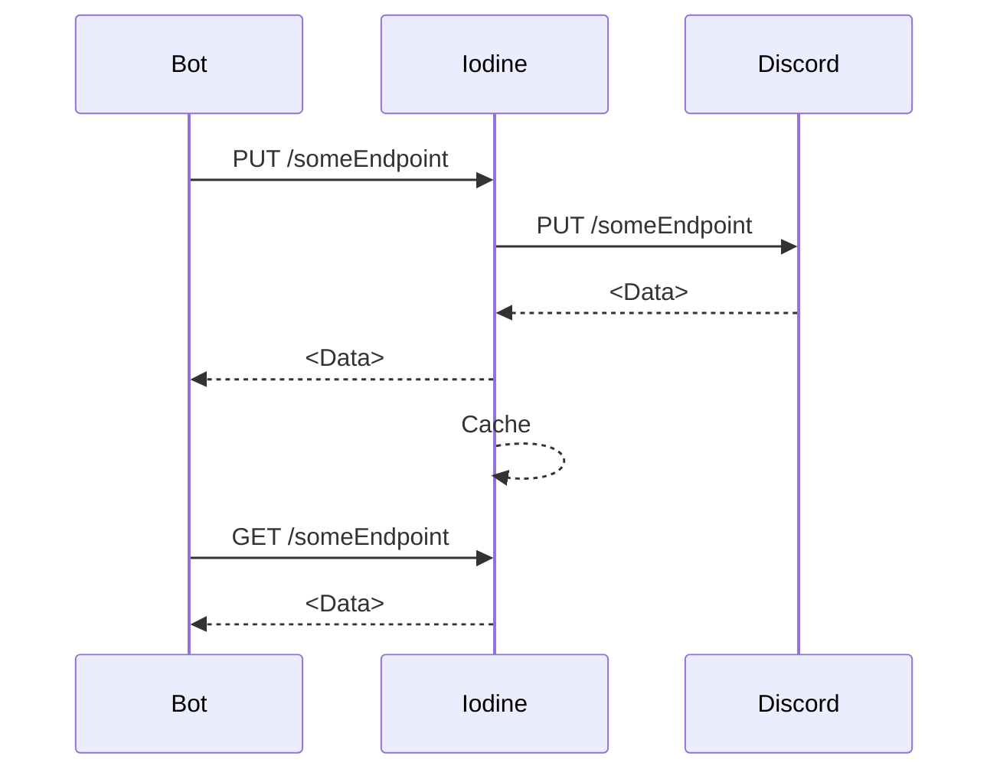

# Iodine - Discord API Proxy
This project is a very barebones implementation of a conceptual Discord API gateway proxy.

This is not to be confused with a tangentially related product (Retsu), which operates on the *gateway*. 
Both of these tools act in a synergistic manner to provide a simpler work model for end-consumers.

---

The idea behind this project is to effectively proxy Discord's API behind a cache layer.
While many Discord libraries include handling caching, and especially rate-limiting, this project aims to handle both of those.

Most libraries' caching is handled in-process, making the data stored both ephemeral, and specific to the process 
(generally representing a shard, or shard cluster). This is fine for most scenarios, but for larger bots, this generally isn't suitable
behavior.

---
Instead, Iodine caches responses from Discord (on `POST`/`PUT`/`PATCH`), and returns this cached data on subsequent `GET` requests.

In the event that there is no data cached for a particular endpoint, it is instead "thunked" to Discord's API.

