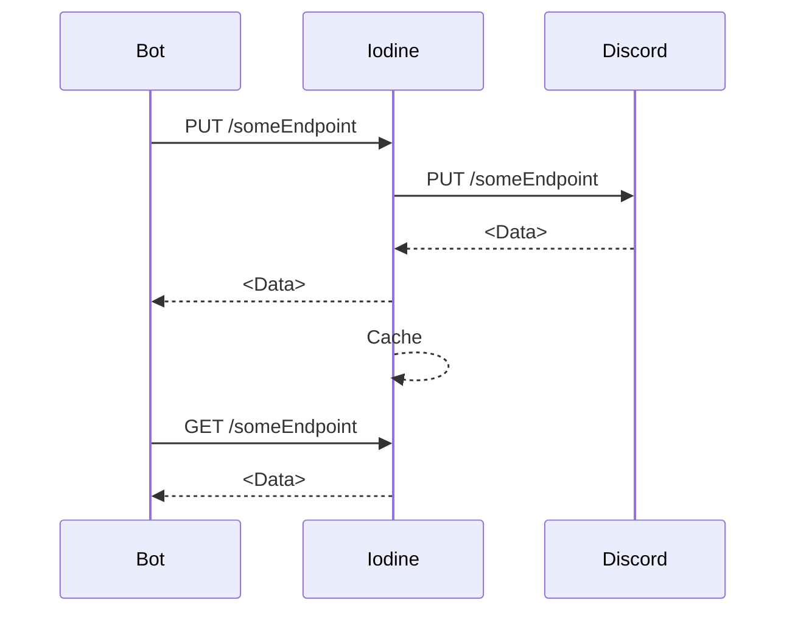

# Iodine — Discord API Proxy
This project is a very barebones implementation of a conceptual Discord API gateway proxy.

Iodine is very similar to Retsu in regards to functionality, however it is worth noting that Retsu
operates on the *gateway*, while Iodine operates on the *REST API*; that being said, both Retsu and Iodine
are designed to work in tandem, allowing developers to focus on functionality, and building simpler products. 

---

The idea behind this project is to effectively proxy Discord's API behind a cache layer.
While many Discord libraries include handling caching, and especially rate-limiting, this project aims to handle both of those.

Most libraries' caching is handled in-process, making the data stored both ephemeral, and specific to the process 
(generally representing a shard, or shard cluster). This is fine for most scenarios, but for larger bots, this generally isn't suitable
behavior.

---
Instead, Iodine caches responses from Discord (on `POST`/`PUT`/`PATCH`), and returns this cached data on subsequent `GET` requests.

In the event that there is no data cached for a particular endpoint, it is instead "thunked" to Discord's API.



# Development
> [!IMPORTANT] 
> This project is primarily a proof-of-concept, and **NOT** recommended for production. 

Development of this project is primarily complete functionality wise (see roadmap below). 
Should you want to contribute however, you'll need the prerequisites:

- Redis (on Windows, you'll need to use Docker/WSL2)
- .NET 7 SDK or greater, with the ASP.NET Core runtime
- A [discord application](https://discord.dev)*

> [!NOTE] 
> As per the roadmap below, this is only required for now, 
> and will be deprecated in favor of passing the token over the HTTP headers instead.

This project utilizes ASP.NET Core Minimal APIs, so all endpoints are inside of `Program.cs`. <br/>
Please [open a Pull Request](https://github.com/veldtech/Iodine/pull/new); conventional commits are preferred, but not required.

You'll need to set the following, in either `appsettings.Development.json` or as environment variables (preferred):

`appsettings.Development.json`: 
```json
{
  "Discord" : {
    "Token": "<Discord Bot Token>"
  },
  "Redis" : {
    "Url": "localhost:6379"
  }
}
```

Environment Variables:
`Discord:Token=<Discord Bot Token>`, `Redis:Url=localhost:6379`

> [!IMPORTANT]
> Docker and Kubernetes primarily use YAML for configuring environment variables, 
> so these values should be delimited by `_` and `__` respectively. Alternatively, use a `.env` file.


# Roadmap
Iodine is in a very early stage of development, and prone to missing some niceties that finished software would have.

Our plans currently consist of the following:

- [x] Support caching on `GET` requests
- [x] Support dynamically updating cache on non-idempotent endpoints
- [ ] Utilize a user-provided bot token 
- [x] Forward requests for unsupported endpoints without impeding on latency


# Using Iodine
If you want to use Iodine, follow the development setup steps above to compile the project, and run with `dotnet run`.

> [!WARNING]
> By nature of being a proxy, it's quintessential for security to **NOT** expose this to the internet!
> In the current state of the project, it's designed to be run locally. We will change this to require the client to provide
> a token instead for this exact reason.

By default, it will run on port 5000, however if you're running in Docker/Kubernetes, you can change this port to your liking.

From there, it operates the same as Discord's normal API would, albeit using using the localhost instead. 
Running in docker is preferable, using the following command: `docker run --rm -d -p 5000:5000 iodine`.

From there, you can use the following curl command, or an existing Discord library (this may require some DNS trickery to support in libraries natively):

```
curl -H "Content-Type: application/json" \
    -X POST http://localhost:5000/api/v10/channels/<Your channel here>/messages \
    -d "{""content"":""Iodine works!""}"
```